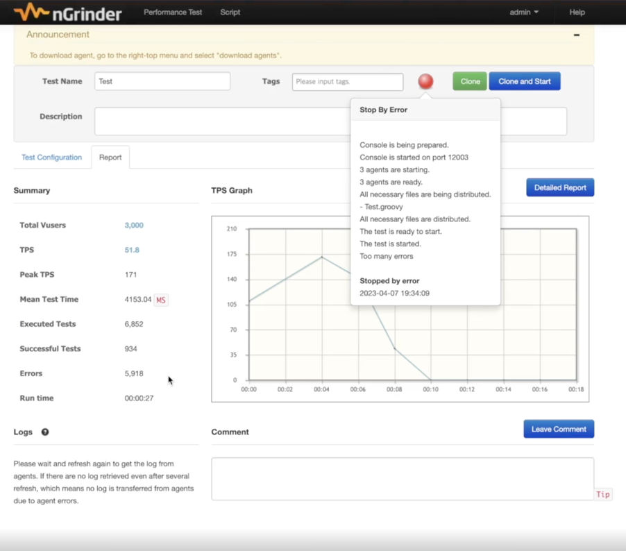

## 선착순 이벤트 시스템
(https://github.com/sangyongchoi/coupon-system)

### 발생할 수 있는 문제점
- 쿠폰이 발급 예정 개수보다 많이 발급된다.
- 이벤트 페이지에 접속이 되지 않는다.
- 이벤트랑 전혀 상관없는 페이지도 느려진다.

### 문제 해결
- 트래픽이 몰렸을 때 대처할 수 있는 방법을 배운다.
- redis를 사용하여 쿠폰발급개수를 보장한다.
- kafka를 활용하여 다른 페이지들에 대한 영향도를 줄여준다.

### 작업환경 세팅
```
docker pull mysql
docker run -d -p 3306:3306 -e MYSQL_ROOT_PASSWORD=1234 --name mysql mysql
docker ps리
docker exec -it mysql bash

mysql -u root -p
create database coupon_example;
use coupon_example;
```

### API 요구사항 정의
- 선착순 100명에게 할인쿠폰을 제공하는 이벤트이다.
- 선착순 100명에게만 지급되어야 한다.
- 101개 이상이 지급되면 안된다.
- 순간적으로 몰리는 트래픽을 버틸 수 있어야 한다.

### 발생하는 문제
- race condition
  - 두 개 이상의 스레드에서 공유 데이터에 액세스할 때 발생하는 문제이다.

### Redis로 해결하기
- 작업환경 세팅
```
docker pull redis
docker run --name myredis -d -p 6379:6379 redis
```

- 락을 활용하여 구현하게 된다면, 쿠폰 개수를 가져오는 로직부터 업데이트하는 로직까지 락을 걸어야 하기 때문에, 성능에 불이익이 있다.
- 숫자를 1 증가시키고 그 값을 리턴하는 명령어이다. 이 명령어를 활용해서 발급된 쿠폰의 개수를 제어한다.
```
incr coupon_count
```

### AWS와 Ngrinder
- AWS와 Ngrinder를 사용하여 단기간에 많은 트래픽 만들기
  - AWS의 LoadBalancer
    - 여러개의 어플리케이션에 트래픽을 분배한다.
- MySQL에 단기간에 많은 트래픽을 주니 에러가 발생하는 것을 확인하였다.


### Kafka
docker-compose.yml
```
version: '2'
services:
  zookeeper:
    image: wurstmeister/zookeeper
    container_name: zookeeper
    ports:
      - "2181:2181"
  kafka:
    image: wurstmeister/kafka:2.12-2.5.0
    container_name: kafka
    ports:
      - "9092:9092"
    environment:
      KAFKA_ADVERTISED_HOST_NAME: 127.0.0.1
      KAFKA_ZOOKEEPER_CONNECT: zookeeper:2181
    volumes:
      - /var/run/docker.sock:/var/run/docker.sock
```

- 카프카 실행 및 종료 명령어
```
docker-compose up -d
docker-compose down
```

- 쿠폰을 생성할 유저의 id를 topic에 넣고, 유저의 id를 가져와서 쿠폰을 생성하도록 바꿔볼 것이다.