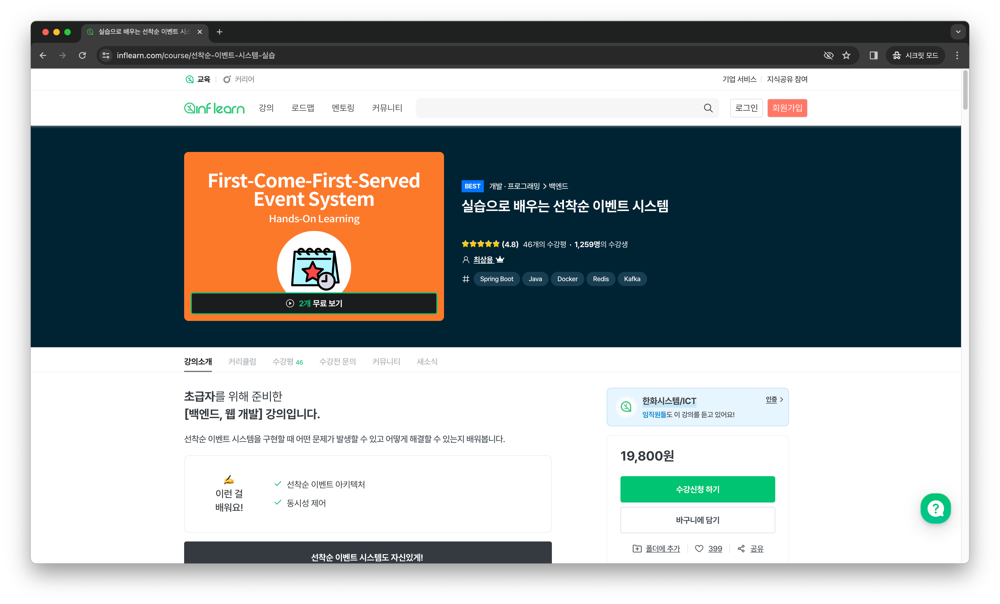
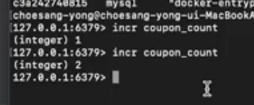
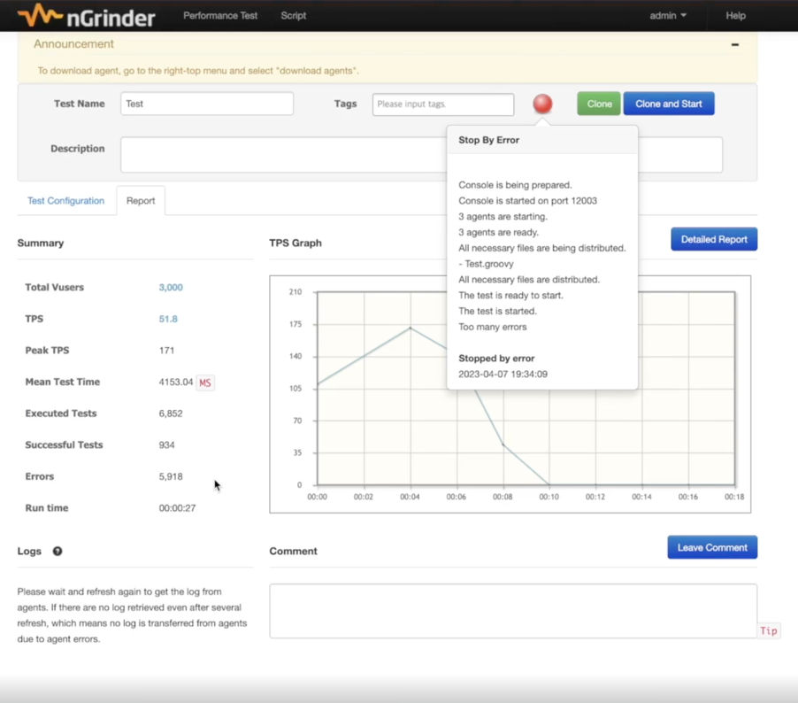
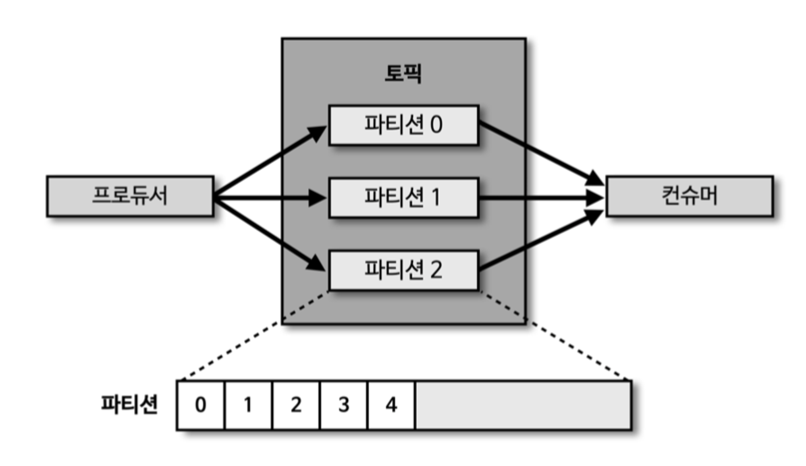

## 선착순 이벤트 시스템
(해당 레포지토리는 [아래의 강의](https://www.inflearn.com/course/%EC%84%A0%EC%B0%A9%EC%88%9C-%EC%9D%B4%EB%B2%A4%ED%8A%B8-%EC%8B%9C%EC%8A%A4%ED%85%9C-%EC%8B%A4%EC%8A%B5)를 수강한 내용을 기반으로 하였습니다.)


### ✔️ 발생할 수 있는 문제점
- 쿠폰이 발급 예정 개수보다 많이 발급된다.
- 이벤트 페이지에 접속이 되지 않는다.
- 이벤트랑 전혀 상관없는 페이지도 느려진다.

### ✔️ 문제 해결
- 트래픽이 몰렸을 때 대처할 수 있는 방법을 배운다.
- redis를 사용하여 쿠폰발급개수를 보장한다.
- kafka를 활용하여 다른 페이지들에 대한 영향도를 줄여준다.

### ✔️ 작업환경 세팅
```
docker pull mysql
docker run -d -p 3306:3306 -e MYSQL_ROOT_PASSWORD=1234 --name mysql mysql
docker ps
docker exec -it mysql bash

mysql -u root -p
create database coupon_example;
use coupon_example;
```

### ✔️ API 요구사항 정의
- 선착순 100명에게 할인쿠폰을 제공하는 이벤트이다.
- 선착순 100명에게만 지급되어야 한다.
- 101개 이상이 지급되면 안된다.
- 순간적으로 몰리는 트래픽을 버틸 수 있어야 한다.

### ✔️ 기본 프로젝트
ApplyService.java
```java
public void apply(Long userId) {
    long count = couponRepository.count();
    if (count > 100) {
        return;
    }
    
    couponRepository.save(new Coupon(userId));
}
```

ApplyServiceTest.java
```java
@Test
public void 한번만응모() {
    applyService.apply(1L);
    long count = couponRepository.count();
    assertThat(count).isEqualTo(1);
}

@Test
public void 여러명응모() throws InterruptedException {
    int threadCount = 1000;
    ExecutorService executorService = Executors.newFixedThreadPool(32); // 병렬 작업을 간단하게 할 수 있도록 도와주는 자바의 라이브러리이다.
    CountDownLatch latch = new CountDownLatch(threadCount); // 다른 스레드에서 수행하는 작업을 기다리도록 도와주는 라이브러리이다.

    for (int i = 0; i < threadCount; i++) {
        long userId = i;
        executorService.submit(() -> {
            try {
                applyService.apply(userId);
            } finally {
                latch.countDown();
            }
        });
    }

    latch.await();
    
    long count = couponRepository.count();
    assertThat(count).isEqualTo(100);
}
```

### ✔️ 발생하는 문제
- 테스트 케이스가 실패한다.
- 100개의 쿠폰만 발급되도록 기대했지만, 더 많은 쿠폰이 발급되었다.
- **race condition**이 발생했기 때문이다.
  - 두 개 이상의 스레드에서 공유 데이터에 액세스할 때 발생하는 문제이다.
  - 싱글 스레드로 작업한다면 race condition은 일어나지 않을 것이다.

### ✔️ Redis로 해결하기
- 작업환경 세팅
```
docker pull redis
docker run --name myredis -d -p 6379:6379 redis
docker exec -it {container id} redis-cli
```

- Spring Data Redis 의존성을 추가한다.
```
implementation 'org.springframework.boot:spring-boot-starter-data-redis'
```

- 락을 활용하여 구현하게 된다면, 쿠폰 개수를 가져오는 로직부터 업데이트하는 로직까지 락을 걸어야 하기 때문에, 성능에 불이익이 있다.
  - 예를 들어, 저장하는 로직이 2초가 걸린다면 락은 2초 뒤에 풀리게 되고 이후의 사용자들은 기다려야 한다.
  - 숫자를 1 증가시키고 그 값을 리턴하는 명령어이다. 이 명령어를 활용해서 발급된 쿠폰의 개수를 제어한다.

- **incr 명령어**
  - `incr coupon_count`
  - incr 명령어를사용하면 성능도 빠르고 데이터 정합성도 지킬 수 있다.
  - 숫자를 1 증가시키고 리턴하는 명령어이다.
  - 

CouponCountRepository.java
```java
@Repository
public class CouponCountRepository {
    private final RedisTemplate<String, String> redisTemplate;

    public CouponCountRepository(RedisTemplate<String, String> redisTemplate) {
        this.redisTemplate = redisTemplate;
    }

    public Long increment() {
        return redisTemplate
                .opsForValue()
                .increment("coupon_count"); // redis의 incr 명령어 사용
    }
}
```

ApplyService.java
```java
public void apply(Long userId) {
    long count = couponCountRepository.increment();
    if (count > 100) {
        return;
    }

    couponCreateProducer.create(userId);
}
```

- 테스트가 성공하였다.
  - Redis는 스레드 기반으로 동작하기 때문이다.
  - 모든 스레드에서는 언제나 최신 값을 가져갈 수 있다.
- 이 구조에서 발견할 수 있는 문제점은 다음과 같다.
  - 발급하는 쿠폰의 개수가 많아지면 RDB에 부하를 주게 된다.
  - 서비스의 타임아웃 옵션 때문에 쿠폰 생성 뿐만 아니라 주문 생성, 회원 가입 등의 작업도 되지 않는 오류가 발생할 수 있다.
  - DB 리소스를 많이 사용하게 된다.

### ✔️ AWS와 Ngrinder로 문제점 알아보기
- AWS와 Ngrinder를 사용하여 단기간에 많은 트래픽 만들기
  - AWS의 LoadBalancer
    - 여러개의 어플리케이션에 트래픽을 분배한다.
- MySQL에 단기간에 많은 트래픽을 주니 에러가 발생하는 것을 확인하였다.
  - RDB의 CPU 사용량이 높아지고 이로 인해 서비스의 오류로 이어졌다.


### ✔️ Kafka 기본 구조
- 카프카란
  - 분산 이벤트 스트리밍 플랫폼이다.
  - 이벤트 스트리밍이란 소스에서 목적지까지 이벤트를 실시간으로 스트리밍 하는 것이다.
  - 카프카의 기본 구조는 다음과 같다. ([사진 출처](https://moonsupport.oopy.io/post/22))
    - 
    - Producer
      - 토픽에 데이터를 삽입한다.
    - Topic
      - 일종의 Queue이다.
    - Consumer
      - 토픽에서 데이터를 가져간다.

docker-compose.yml
```
version: '2'
services:
  zookeeper:
    image: wurstmeister/zookeeper
    container_name: zookeeper
    ports:
      - "2181:2181"
  kafka:
    image: wurstmeister/kafka:2.12-2.5.0
    container_name: kafka
    ports:
      - "9092:9092"
    environment:
      KAFKA_ADVERTISED_HOST_NAME: 127.0.0.1
      KAFKA_ZOOKEEPER_CONNECT: zookeeper:2181
    volumes:
      - /var/run/docker.sock:/var/run/docker.sock
```

- 카프카 실행 및 종료 명령어
```
docker-compose up -d
docker-compose down
```

- 토픽 생성
  - `docker exec -it kafka kafka-topics.sh --bootstrap-server localhost:9092 --create --topic testTopic`
- 프로듀서 실행 
  - `docker exec -it kafka kafka-console-producer.sh --topic testTopic --broker-list 0.0.0.0:9092`
- 컨슈머 실행
  - `docker exec -it kafka kafka-console-consumer.sh --topic testTopic --bootstrap-server localhost:9092`
- _프로듀서에 "hello"를 입력하면 컨슈머에서 토픽에 입력된 데이터를 가져오는 것을 확인할 수 있다._

### ✔️ Kafka를 이용하여 문제 해결하기
**쿠폰을 생성할 유저의 id를 topic에 넣고, 유저의 id를 가져와서 쿠폰을 생성하도록 바꿔볼 것이다.**  

build.gradle
```
implementation 'org.springframework.kafka:spring-kafka'
```

KafkaProducerConfig.java
```java
@Configuration
public class KafkaProducerConfig {
    @Bean
    public ProducerFactory<String, Long> producerFactory() {
        HashMap<String, Object> config = new HashMap<>(); // 설정값을 담을 Map

        config.put(ProducerConfig.BOOTSTRAP_SERVERS_CONFIG, "localhost:9092"); // 서버의 정보
        config.put(ProducerConfig.KEY_SERIALIZER_CLASS_CONFIG, StringSerializer.class); // 키 시리얼라이즈 정보
        config.put(ProducerConfig.VALUE_SERIALIZER_CLASS_CONFIG, LongSerializer.class); // 밸류 시리얼라이즈 정보

        return new DefaultKafkaProducerFactory<>(config);
    }

    @Bean
    public KafkaTemplate<String, Long> kafkaTemplate() {
        return new KafkaTemplate<>(producerFactory()); // 카프카 토픽에 데이터를 전송하기 위한 카프카 템플릿
    }
}
```

CouponCreateProducer.java
```java
@Component
public class CouponCreateProducer {
    private final KafkaTemplate<String, Long> kafkaTemplate;

    public CouponCreateProducer(KafkaTemplate<String, Long> kafkaTemplate) {
        this.kafkaTemplate = kafkaTemplate;
    }

    public void create(Long userId) {
        kafkaTemplate.send("coupon_create", userId); // "coupon_create" 토픽에 userId를 전달한다.
    }
}
```

ApplyService.java
```java
public void apply(Long userId) {
    long count = couponCountRepository.increment();
    if (count > 100) {
        return;
    }

    // 직접 쿠폰을 생성하는 로직을 삭제하고 ➡️ Coupon Create Producer를 사용해서 토픽에 유저의 아이디를 전송한다.
    couponCreateProducer.create(userId);
}
```

✚ **컨슈머 모듈을 별개로 생성한다.**
KafkaConsumerConfig.java
```java
@Configuration
public class KafkaConsumerConfig {
    @Bean
    public ConsumerFactory<String, Long> consumerFactory() {
        Map<String, Object> config = new HashMap<>(); // 설정 값을 담을 맵

        config.put(ConsumerConfig.BOOTSTRAP_SERVERS_CONFIG, "localhost:9092"); // 서버의 정보 
        config.put(ConsumerConfig.GROUP_ID_CONFIG, "group_1"); // 그룹 아이디 정보
        config.put(ConsumerConfig.KEY_DESERIALIZER_CLASS_CONFIG, StringDeserializer.class); // 키 디시리얼라이즈 클래스 정
        config.put(ConsumerConfig.VALUE_DESERIALIZER_CLASS_CONFIG, LongDeserializer.class); // 밸류 디시리얼라이즈 클래스 정보

        return new DefaultKafkaConsumerFactory<>(config);
    }

    @Bean
    public ConcurrentKafkaListenerContainerFactory<String, Long> kafkaListenerContainerFactory() {
        ConcurrentKafkaListenerContainerFactory<String, Long> factory = new ConcurrentKafkaListenerContainerFactory<>();
        factory.setConsumerFactory(consumerFactory());

        return factory;
    }
}
```

CouponCreatedConsumer.java
```java
@Component
public class CouponCreatedConsumer {
    private final CouponRepository couponRepository;
    private final FailedEventRepository failedEventRepository;
    private final Logger logger = LoggerFactory.getLogger(CouponCreatedConsumer.class);

    public CouponCreatedConsumer(CouponRepository couponRepository, FailedEventRepository failedEventRepository) {
        this.couponRepository = couponRepository;
        this.failedEventRepository = failedEventRepository;
    }

    // 데이터를 가져오기 위한 메소드
    @KafkaListener(topics = "coupon_create", groupId = "group_1")
    public void listener(Long userId) {
        couponRepository.save(new Coupon(userId)); // 원래 ApplyService에서 생성하던 쿠폰을 Consumer에서 생성하도록 바꾸었다.
    }
}
```

### ✔️ 추가 요구사항 - 1인당 발급가능한 쿠폰 개수를 1개로 제한하기
구현 방법
1. coupon type 필드를 추가하고 Unique Key 제약을 만듦으로써 데이터베이스 레벨에서 막는 방법이 있다.
2. 로직 전체를 범위로 락을 잡고 쿠폰 발급 여부를 가져와서 판단하는 방식이다. 락을 시작하고 쿠폰 발급 여부를 확인하고 발급되었다면 거절하는 것이다. 하지만, 컨슈머에 유저의 아이디가 들어오고 실제 쿠폰이 발급되기 까지 시간차가 존재하기 때문에 한 명이 두 번 발급될 수 있다. (즉, API와 Consumer의 시간차)
3. Set(값을 유니크하게 저장할 수 있는 자료구조) 자료구조를 이용한다.

### ✔️ Redis의 Set 자료구조를 이용하여 해결하기
`sadd test 1`  
test라는 키에 1이라는 밸류를 저장한다. 추가되었다면 추가된 밸류의 개수를 리턴한다. 이미 있다면 0을 리턴할 것이다.

AppliedUserRepository.java  
(Set을 관리할 레포지토리이다.)
```java
@Repository
public class AppliedUserRepository {
    private final RedisTemplate<String, String> redisTemplate;

    public AppliedUserRepository(RedisTemplate<String, String> redisTemplate) {
        this.redisTemplate = redisTemplate;
    }

    public Long add(Long userId) {
        return redisTemplate // redisTemplate을 이용해서
                .opsForSet() // set에
                .add("applied_user", userId.toString()); // 저장한다 
    }
}
```

ApplyService.java
```java
public void apply(Long userId) {
    Long apply = appliedUserRepository.add(userId);
    if (apply != 1) { // 1이 아니라면 이미 쿠폰을 발급했던 유저일 것이다.
        return;
    }

    long count = couponCountRepository.increment();
    if (count > 100) {
        return;
    }

    couponCreateProducer.create(userId);
}
```

### ✔️ 쿠폰을 발급하다가 에러가 발생하면?
컨슈머에서 토픽에 있는 데이터를 가져간 후에 쿠폰을 발급하는 과정에서 쿠폰이 발급되지 않았는데 발급된 쿠폰의 개수만 증가할 수 있다.  
쿠폰을 발급하다가 오류가 발생하면 백업 데이터와 로그를 남기는 과정을 추가한다.

FailedEvent.java
```java
@Entity
public class FailedEvent {
    @Id @GeneratedValue(strategy = GenerationType.IDENTITY)
    private Long id;

    private Long userId;

    public FailedEvent() {
    }

    public FailedEvent(Long userId) {
        this.userId = userId;
    }
}
```

CouponCreatedConsumer.java
```java
@KafkaListener(topics = "coupon_create", groupId = "group_1")
public void listener(Long userId) {
    try {
        couponRepository.save(new Coupon(userId));
    } catch (Exception e) {
        logger.error("failed to create coupon::" + userId); // 로그를 남기고
        failedEventRepository.save(new FailedEvent(userId)); // 실패한 유저의 아이디를 저장한다
    }
}
```

그리고, 이후에 배치 프로그램에서 failed event에 쌓인 데이터를 주기적으로 읽어서 쿠폰을 발급하면 된다.